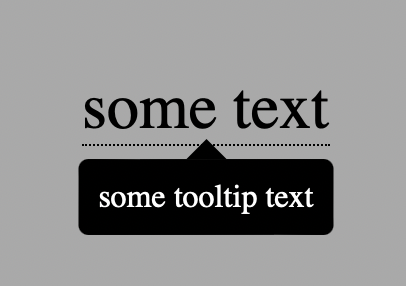
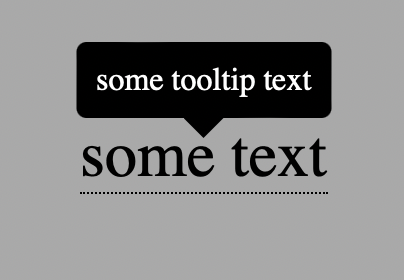
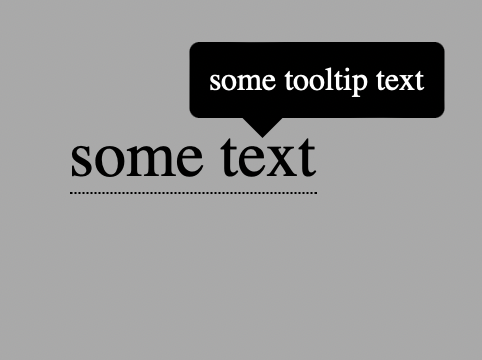
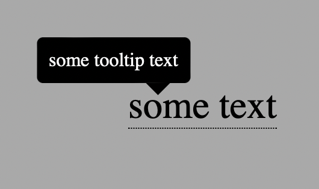
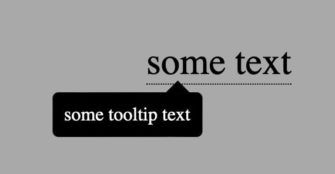
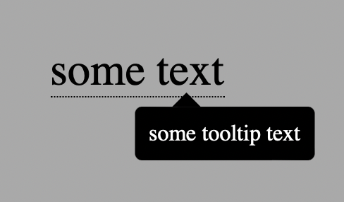

# tooltip-react
A React component implementation of the tooltip code.

## Table Of Contents
* [General Info](#general-info)
* [Technologies Used](#technologies-used)
* [Features](#features)
* [Setup](#setup)
* [Usage](#usage)
* [Project Status](#project-status)
* [Room for Improvement](#room-for-improvement)
* [Contact](#contact)

## General Info
This project entails an example of the various tooltip configurations possible by using the Tooltip ReactJS component contained therein.
## Technologies Used
This project is created using:
* ReactJS - Used to create the Tooltip component and the example that contains it.
* SCSS - Used to programmatically alter the orientations of the arrow tip and the displacement of the area containing the text.
* JSX - Used for the code that creates the ReactJs Component and example code. 
## Features
The Tooltip Component allows configuration of text and tooltip text, as in the below examples where text is set to be "some text" and the tooltip text is set to display "some tooltip text." Furthermore, the orientation of the arrow tip and displacement of the area containing the text can be configured to any combination of upper and lower and center, left, and right.

||
|:--:|
|example of default orientation|

||
|:--:|
|example of upper center orientation|

|
|:--:|
|example of upper right orientation|

||
|:--:|
|example of upper left orientation|

||
|:--:|
|example of lower left orientation|

||
|:--:|
|example of lower right orientation|
## Setup
To setup the component for use in your ReactJS project, simply add the Tooltip folder from this project along with the appropriate index.js entry:
```
import { Tooltip } from './components';
```
Then, add in the <Tooltip component as appropriate.
```
<Tooltip type={type} text="some text" tooltipText="some tooltip text" />
```
And, lastly, edit the tooltip-config.js file to the user's liking.
## Usage
Setup the Tooltip component for usage in your project as described in the Setup section. After that has been completed, there are two places where the configuration of the component is done.

First, add the necessary props to the Tooltip component, type, text, and tooltipText. The first prop, type, configures the orientation of the tooltip in one of the following ways: "default", which is the lower center orientation, "upper", the upper center orientation, and the rest of which, which are self-explanatory: "upper right", "upper left", "lower right", and "lower left."

The other props are those which define the text to which the tooltip is attached and the tooltipText is the text of the tooltip. Just assign a string to each of these and the tooltip will work correctly.

Next, define the font-size, background color of the tooltip, and the text color of the tooltip. Assign these values to the variables defined in the tooltip-configure.scss file. Finally, define the styles associated with the text to which to the tooltip is attached. 
## Project Status
This project will remain in production until such time as I no longer need to update the tooltip to accomodate any project for which I may have the need.
## Room for Improvement
As indicated in the Project Status section, the need may arise so that the tooltip may need to adjusted for some particular project.
## Contact
Feel free to contact me @michaelrjamesjr on twitter or on github @micrjames or check out my blog at michaelrjames.hashnode.dev
